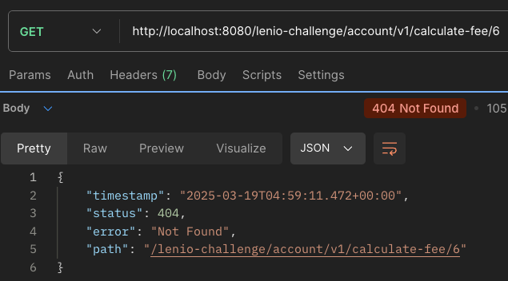
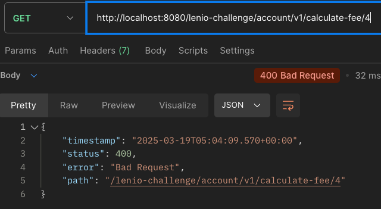
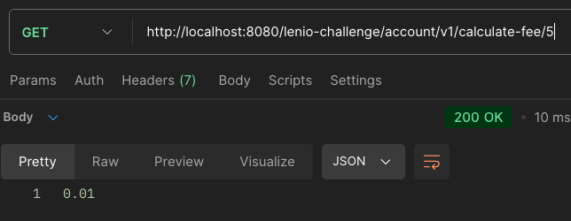
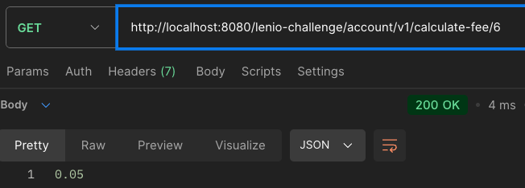

# Lenio Labs Java Challenge

Small API REST for account management

## Challenge description

Develop the logic inside FeeCalculatorFactory and AccountController, taking into account that AccountController must return the fee based on the type of the account object.

## DO NOT change any Spring and/or custom annotations

The solution you have to provide must be developed and built inside the above mentioned classes.

## Mocking tests are not required!

But you can include them

## Solution

### Factory Pattern
This implementation uses the Factory Pattern to encapsulate the logic for selecting the appropriate implementation of the
`FeeCalculator` interface. The pattern delegate the responsibility of object instantiation to the "factory" class `FeeCalculatorFactory`.

### Custom Qualifier: `@AccountType`
The `@AccountType` is a custom annotation that marks each implementation of `FeeCalculatorIF` with a unique identifier (value). This helps dynamically select the correct implementation based on the account type.

### Implementation of `FeeCalculatorFactory`

The `FeeCalculatorFactory` organizes all implementations of `FeeCalculatorIF` marked as Spring components (`@Component`). It achieves this by injecting a list of these implementations and converting them into a map, where the keys correspond to the values defined in the custom annotation `@AccountType`. This approach allows for the automatic selection of the appropriate calculator based on the account type, eliminating the need for conditional logic like `if-else` or `switch`.
 
 
In the `AccountController`, the fee calculation method leverages this factory to fetch the appropriate calculator based on the account type of the `Account` object. This solution adheres to design principles such as decoupling and dependency inversion, ensuring that the controller interacts only with the interface and not with the concrete implementations.

### Response

 - Response when the account is not found: `404 NOT FOUND`
    
 - Response when the account type is not found: `400 BAD REQUEST`
   
 - Response when the account type is personal
   
 - Response when the account type is corporate
   